---
format:
  revealjs: 
    theme: [simple, slide-style.scss]
    embed-resources: true
bibliography: references.bib
csl: apa.csl
---

# Introduction to MAXQDA {footer="false"}

Jess Hagman \| jhagman\@illinois.edu \| Consultations: [go.illinois.edu/hagman](https://go.illinois.edu/hagman)

More workshops and additional QDA resources: [go.illinois.edu/qda](https://go.illinois.edu/qda "QDA Resources Research Guide")

# Workshop Prep

::::: columns
::: {.column width="50%"}
If you don't have MAXQDA on your device yet, go to [**https://maxqda.com/download-now** ]{font-size="1.5em"}
:::

::: {.column width="50%"}
Download files to practice creating a project file at: **https://go.illinois.edu/maxqda-intro-data**
:::
:::::

# What this Workshop Covers

Because MAXQDA is a complex program, I teach its use across three workshops. This workshop is intended for those without any previous experience using MAXQDA and covers:

- How to get access to MAXQDA using the license provided by UIUC
- Creating a new project and storing your project data files
- Adding data to your project file
- Creating codes and applying codes to text data
- Working on a MAXQDA project with other researchers.

# Accessing MAXQDA via the Illinois license

This section demonstrates how to use MAXQDA with the license provided by the University of Illinois Urbana-Champaign for current students, faculty, and staff.

The Illinois license is the [Analytics Pro version](https://www.maxqda.com/products/maxqda-analytics-pro), which includes statistical analysis features, with the [Premium AI-Assist Add-on](https://www.maxqda.com/products/ai-assist).

For more on the license available at Illinois, please [see Illinois Computes' information page](https://www.maxqda.com/products/maxqda-analytics-pro).

::: callout-important
## Access off-campus requires using the VPN

If you are working off-campus, you will need to be connected to the campus network via the [Virtual Private Network (VPN)](https://www.techservices.illinois.edu/services/vpn-essentials/). Once you have connected to the VPN, the steps for accessing MAXQDA remain the same.

Technology Services offers [instructions for setting up the VPN.](https://answers.uillinois.edu/illinois/98773)
:::

## Downloand and install MAXQDA on your device

If you haven't yet, [download the MAXQDA program](https://www.maxqda.com/download-now) to you Mac or Windows computer. Follow the usual procedures for installing software on your device.

::: callout-tip
## If you can't install MAXQDA on your own device

If you cannot, or do not want to install the MAXQDA software on your compute, you can use the University's virtual desktop service [Illinois AnyWare](https://www.techservices.illinois.edu/services/illinois-anyware/). This service lets you access a Windows desktop from your own device and use the [software installed on that desktop](https://static.ics.illinois.edu/anyware-software/) without having to add them to your own device.
:::

## Choose the option for the network license

:::::: columns
::: {.column width="40%"}
Open the program. The first time you open MAXQDA on a new device, you will need to set the license information. You should see a screen that says Welcome to MAXQDA and then asks you to choose a license option.

Click on the option that says `Connect to your institution's network license`
:::

:::: {.column width="60%"}
::: {}
{width="325"}
:::
::::
::::::

## Enter license information

::::: columns
::: {.column width="40%"}
After you choose to make use of an institutional license, you'll be prompted to enter the license details.

1.  In the first box asks for your institution's server address. Enter: `maxqda.webstore.illinois.edu`
2.  Set the Port to `21990`
3.  Make sure the radio button for the last box is checked and enter the license name `MAXQDA` (all caps included).
4.  Click `Connect`.
:::

::: {.column width="60%"}
{width="340"}
:::
:::::

# Linking a MAXQDA Account (Optional)

In addition to the network license, you may choose to log into the MAXQDA program with a (free) MAXQDA account. This account is not connected to your Illinois license, and you can use any email you prefer.

You only need to connect a license if you want to use the AI-Assist features (which is included in the Illinois license) or any of the other add-on features that can be purchased from MAXQDA, including automated transcription and Team Cloud tools.

To link a MAXQDA account:

1.  Create an account [on the MAXQDA website](https://account.maxqda.com/register).
2.  Look for the `Sign In` option in the upper right corner of the program.
3.  Enter your account details.

# Set Interface Language (Optional)

MAXQDA's interface is available in English as well as [12-additional languages](https://www.maxqda.com/help/the-workspace/general-preferences).

Use `MAXQDA > Preferences` to open the preferences pane. Choose `Language` from the list of options on the left. Choose your preferred interface language from the drop down menu.

{fig-alt="MAXQDA preferences screen on the language settings. The English option is set. The drop down can be used to choose another language. "}

# Working With Other Researchers

Teamwork in MAXQDA is more complex than for many modern software programs, as there is now way for two individuals to work in the same document at the same time (as you would with a Google Doc or online Word document).

Instead you can:

- Work on the project file in a shared location, ensuring that only one user accesses the project file at a time.
  - This is the easiest option, especially for small teams. The project file is stored an an appropriate location accessible to all team members who then coordinate to work on the file at different times.
- Import/Export Teamwork data:
  - If you have

# Creating a New MAXQDA Project

:::::: columns
::: {.column width="40%"}
When you first open MAXQDA, you'll be prompted tho choose what project file you want to work with.

The three options are to:

1.  Create an entirely new project.
2.  Open an existing MAXQDA project.
3.  Create a file that contains example data for exploring MAXQDA features.
:::

:::: {.column width="60%"}
::: {}

:::
::::
::::::

## Choose a project location

After you choose to create a new project, you'll be prompted to choose where you want the project file to be stored.

MAXQDA recommends that you do not open a project file directly form an external storage system like a networked drive, flash drive, or a cloud storage service (like OneDrive, Box, or Google Drive).

If your project and data files are stored in cloud storage, they recommend instead that you make a copy of the file to save directly to your local device. When you have completed your work you can re-upload the project file to the cloud storage.

::: callout-tip
## Managing project files

I recommend that you make a copy of your project each time you work with it and save the new file with a date or other distinguishing feature. This saves previous working copies in case you have problems with the new file or want to return to previous versions of the data.

Example file naming convention: 2026-09-16-Project.mqda.
:::

## Where does MAXQDA store project data?

You choose where to store your project file and any data you upload to MAXQDA. If you save the project file in a shared folder or cloud service, then the shared settings of those locations will also apply to your data.

::: callout-caution
## Follow data security and privacy requirements for your project

If you are working with [high risk, sensitive, or internal data](https://www.techservices.illinois.edu/cybersecurity/data-classification/), you must consider your data security requirements when choosing where to store your MAXQDA project data.
:::

## External files

::::: columns
::: {.column width="40%"}
MAXQDA keeps larger data files in a separate folder that allows the data to be accessible for analysis, but without making the project file itself too large. The external file location is the same for all MAXQDA projects, but can be a location you choose.[^1]

Open `MAXQDA > Preferences` to change the external file settings.

1.  By default, any file over 5MB is saved as an external file. You can change this limit to be larger or smaller.

2.  You can change the location for external files by clicking on the `...` button and then choosing a new location on your device.
:::

::: {.column width="60%"}

:::
:::::

[^1]: [MAXQDA Manual: External Files](https://www.maxqda.com/help/import/external-files)

# The MAXQDA Interface

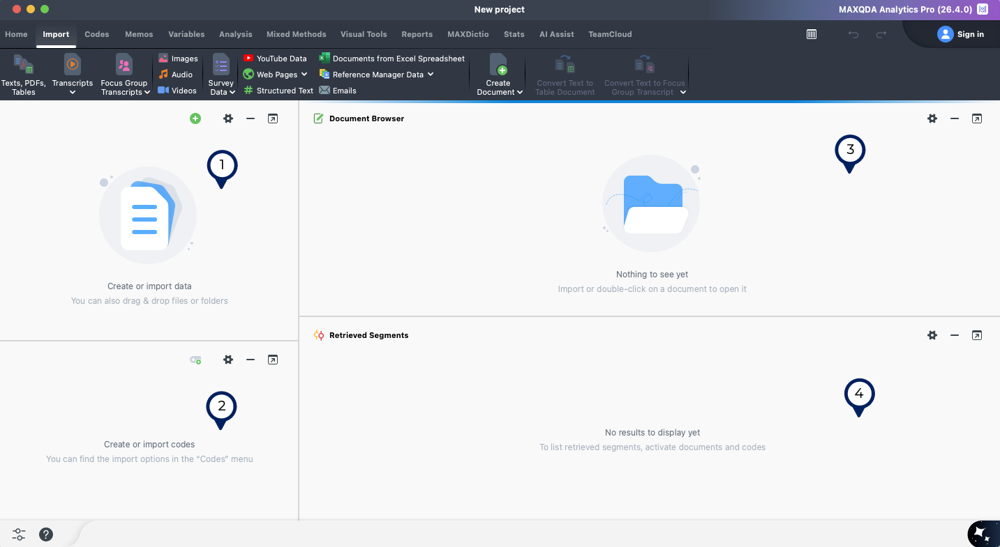

# Adding Data to Your Project File

You can import many different types of data into your MAXQDA project file. The `Import` menu shows these options.

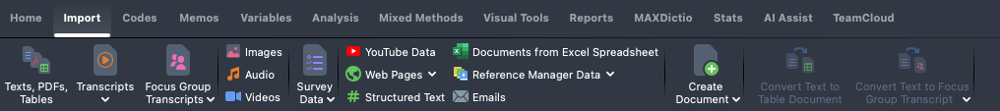

## Text data, including transcripts without time stamps.

If you have existing transcript files without time stamps or a linked video or audio file, you can upload these to MAXQDA in any of the acceptable text formats.[^2]

[^2]: [MAXQDA Manual: Supported data types](https://www.maxqda.com/help/import/data-types)

To upload text files:

1.  Import \> Texts, PDFs, Tables
2.  Select the file(s) you want to upload.
3.  OR drag and drop files from your computer's file system into the document system window.

::: callout-tip
## Highlights and comments in Word and PDFs will be imported

If you have Word or PDF documents with existing highlighted text or comments, these will be imported to MAXQDA. Highlights are converted to coded segments, with the highlight color becoming a code. Comments will be added to the MAXQDA document as they are in the original document.
:::

## Transcript data: Linking time stamped transcripts with audio or video files

You can also upload transcripts with time stamps and link them with the recording of conversation.[^3] These transcripts can include the files you get from Zoom or Teams (in the .vtt file format).

[^3]: [MAXQDA Manual: Importing Transcripts](https://www.maxqda.com/help/import/transcripts)

::::: columns
::: {.column width="40%"}
To upload and link transcripts and a media file:

1.  Import \> Transcripts \> Transcripts with Timestampts
2.  Select the file you want to upload
3.  You'll be prompted to also upload the audio or video file that goes with the transcript. Click `OK`
4.  Once both files have been uploaded, you will have a text file linked with the media file so you can click on the time stamp to open the recording.
:::

::: {.column width="60%"}
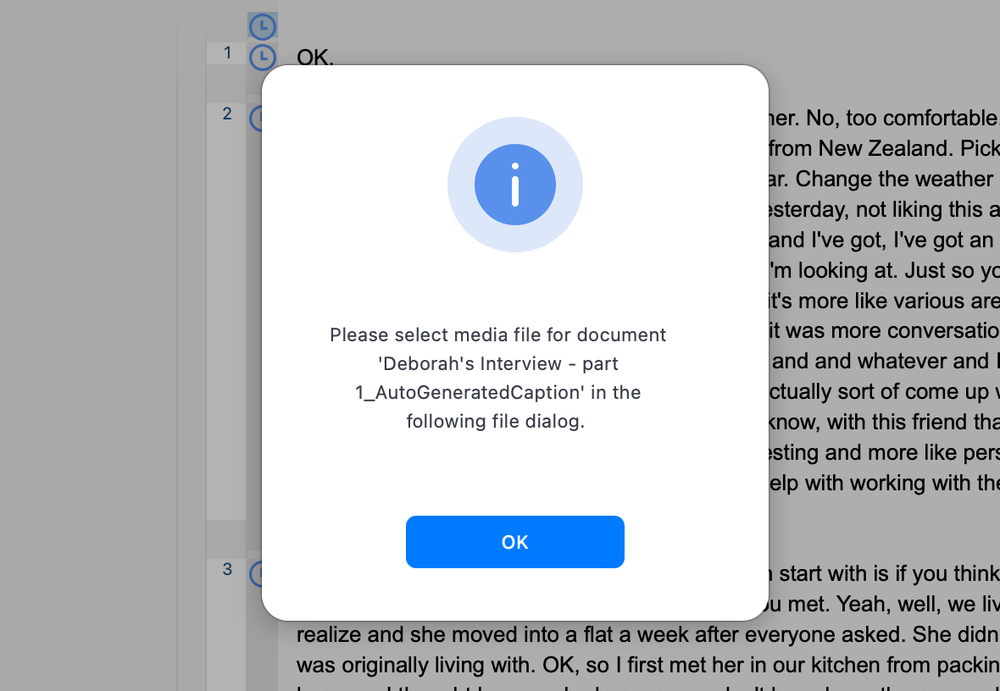{fig-alt="Pop up menu asking the user to: Please select media file for document 'Deborah's Interview - part 1_AutoGeneratedCaption' in the following file dialog."}
:::
:::::

## Editing transcripts with time stamps

If you want to edit the transcript after you have uploaded it to MAXQDA, look for the edit/transcribe/view mode toggle in the upper left of the document window.

In edit mode, you can change the text of the transcript.

In transcribe mode, you can edit the location of the time stamps or add new time stamps.

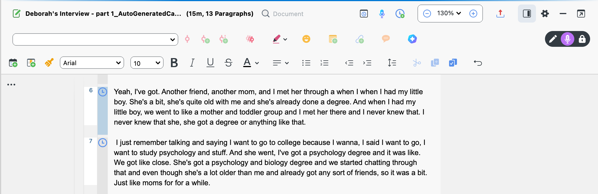{width="100%"}

To add a time stamp,

1.  Navigate to the point in the video or audio file where you want to add the time stamp
2.  Place the cursor in the place in the transcript where you want to add the time stamp
3.  Click `enter`. This will move the transcript text to a new line and add a time stamp icon that you can use to open the media file at that point.

## Transcribing in MAXQDA

If you do not have transcripts, or draft transcripts, you can use the transcription feature in MAXQDA to create or edit a transcript file.[^4]

[^4]: [MAXQDA Manual: Transcription Mode](https://www.maxqda.com/help/transcription-audio-video/transcription-mode)

::::: columns
::: {.column width="40%"}
To manually transcribe a media file

1.  Import \> Audio or Video
2.  Select the video or audio file you want to upload.
3.  Choose `Import only` from the three options provided. If you choose `Link Transcript` you'll be able to upload an existing transcript, while `Transcribe` opens MAXQDA's auto transcription tool.[^5] This is a paid feature not included in the Illinois license.
:::

::: {.column width="60%"}
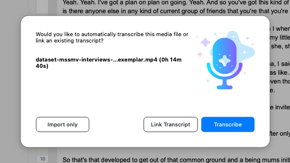
:::
:::::

[^5]: [MAXQDA Manual: Automatic Transcription](https://www.maxqda.com/help/transcription-audio-video/automatic-transcription/transcribe-in-maxqda)

## Using transcription mode

In the example below, we've uploaded a video file and have transcription mode enabled (#1). Play and pause the video and then type the content in the window (#2). Pressing enter will add a new time stamp.

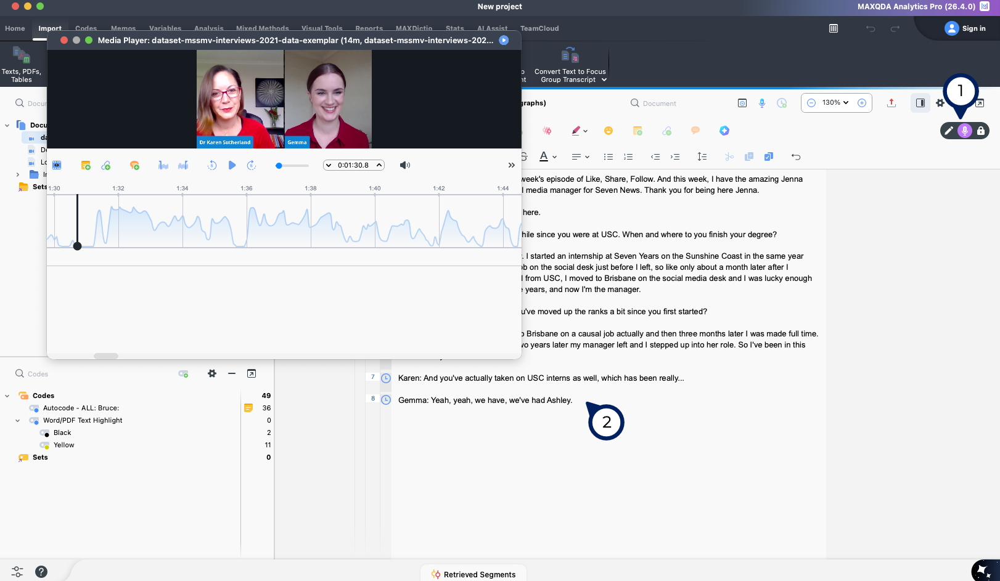

## Survey data

MAXQDA can be used to analyze survey data with open-ended responses, or any data structured in a spreadsheet format.[^6]

[^6]: [MAXQDA Manual: Survey Data from Excel](https://www.maxqda.com/help/import/survey-data-and-structured-data-from-excel)

::::: columns
::: {.column width="40%"}
Each row in the spreadsheet you upload will become a new document, with the columns created as qualitative data you can code, variables, or both.
:::

::: {.column width="60%"}
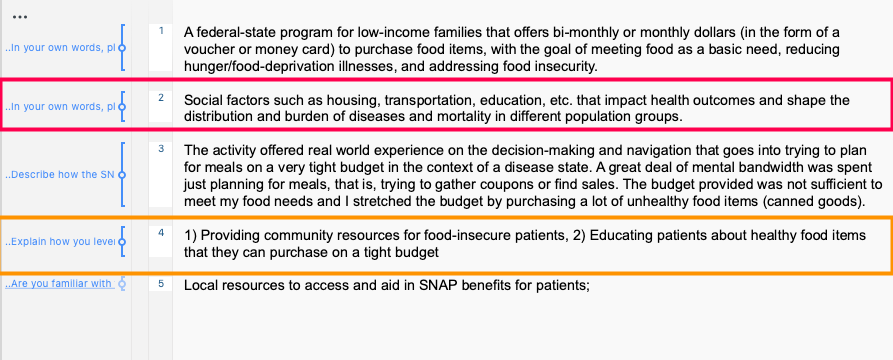
:::
:::::

------------------------------------------------------------------------

### Preparing survey data for upload

::::: columns
::: {.column width="40%"}
To prepare your Excel file for upload:

1.  Ensure that the first row includes only column headers.
2.  Add a column for a document ID (#1). This can be any unique indicator.
3.  (Optional) Add a column for Document Groups (#2). This will place the document into a group you have identified. I
:::

::: {.column width="60%"}
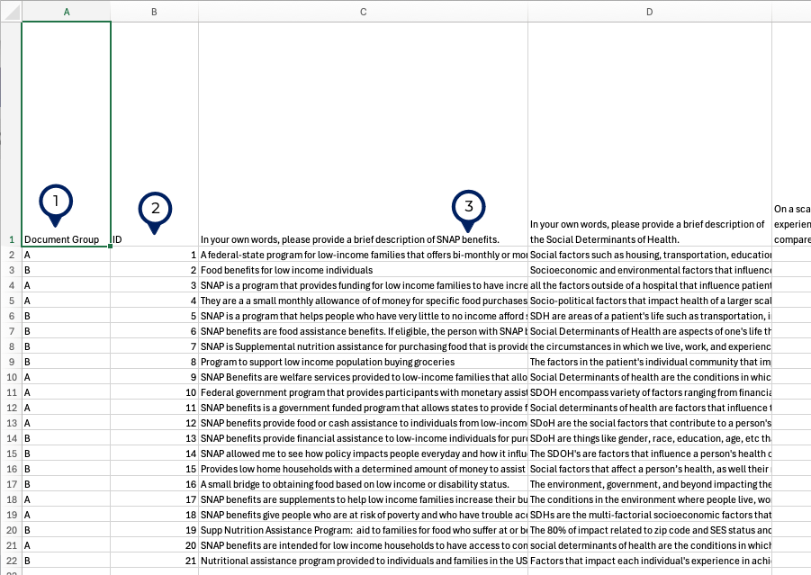
:::
:::::

------------------------------------------------------------------------

### Upload survey data

::::: columns
::: {.column width="40%"}
To upload survey data from an Excel file, use:

1.  `Import` \> `Survey Data` \> `Import Survey Data from Excel Spreadsheet`
2.  Choose the Excel file you want to upload
3.  Preview the import - this screen should confirm the number of responses (called cases here)
:::

::: {.column width="60%"}
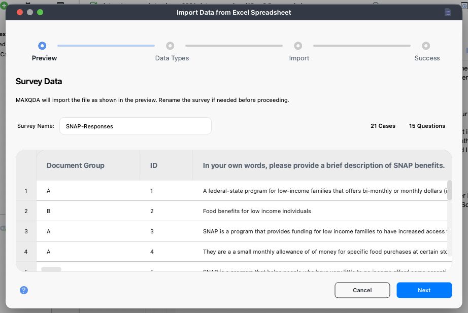
:::
:::::

------------------------------------------------------------------------

### Identify data types

::::: columns
::: {.column width="40%"}
You will need to confirm which of the rows in your spreadsheet should be text that you can code, and which are variables (or both).

In the example here, we have 15 questions in the survey. The question labeled #1 is an open ended question and so we've checked the box in the `Qualitative` column.

The question labeled #2 is a Likert scale item and a number from 1-5. We've identified this as an integer variable in the `Quantitative` column.
:::

::: {.column width="60%"}
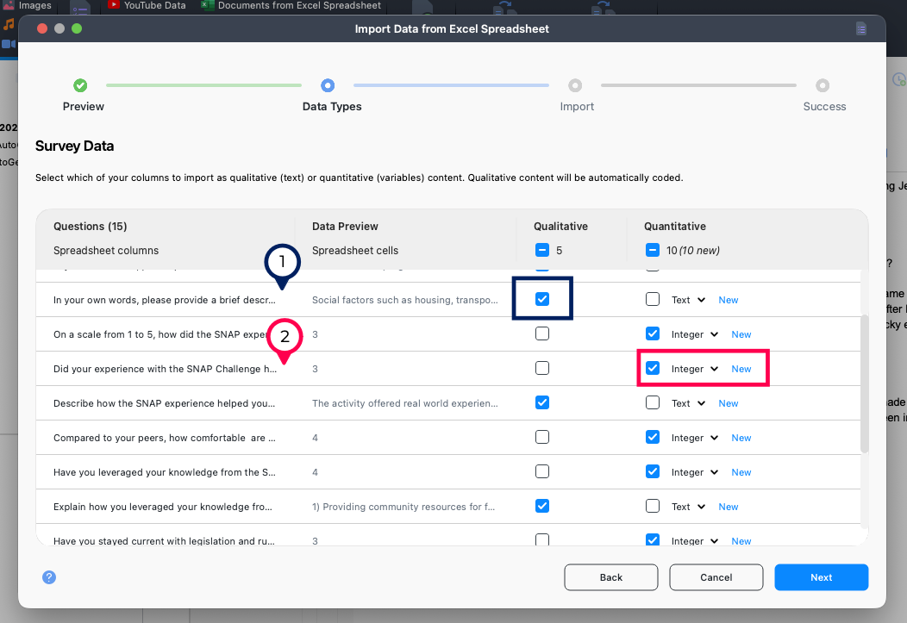
:::
:::::

------------------------------------------------------------------------

### Identify document names and groups

::::: columns
::: {.column width="40%"}
Finally, we'll need to tell MAXQDA which row contains the names we want to use for each document and (optionally) which group the document should be placed in.

In this case, we'll use the column ID (#1). If you do not have a column for document names, you can also have MAXQDA create unique case IDs.

We also have two document groups in our spreadsheet, A and B. The Document Group column (#2) is used to tell MAXQDA which group each response should be located in.
:::

::: {.column width="60%"}
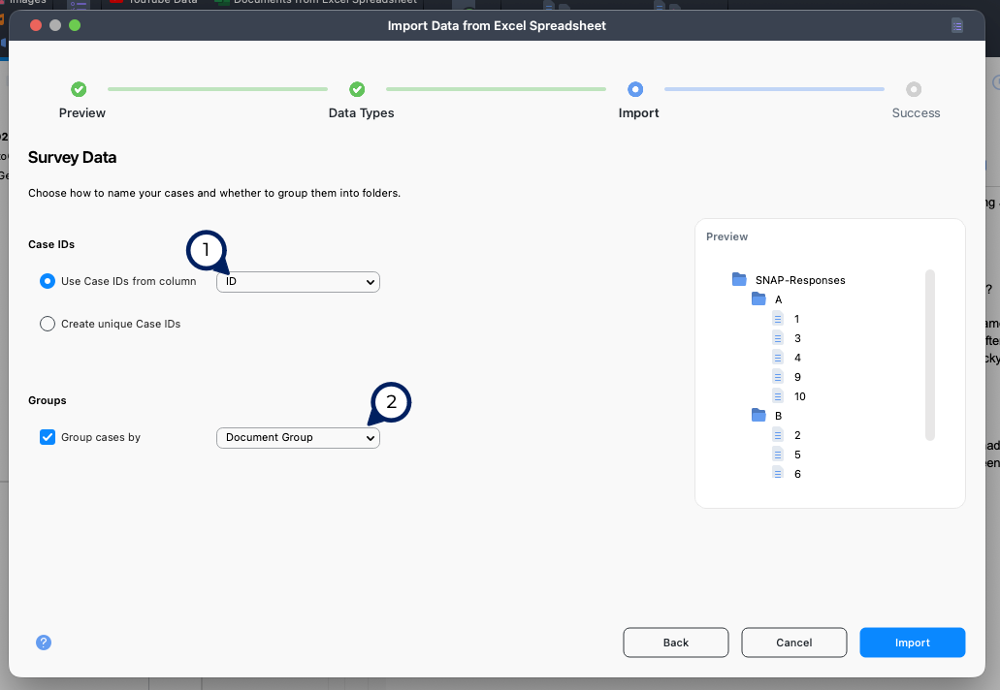
:::
:::::

# Getting Started with Coding

The following is a basic introduction to creating codes in MAXQDA and applying them to text data. For additional coding tools, see the workshop on Coding Qualitative Data in MAXQDA.

## Creating codes

::::: columns
::: {.column width="40%"}
The simplest way to create codes is using the `New Code` icon at the top of the code system. A new window will open where you will enter the name of a code, choose a color for the code, and (optionally) enter a memo.
:::

::: {.columns width="60%"}
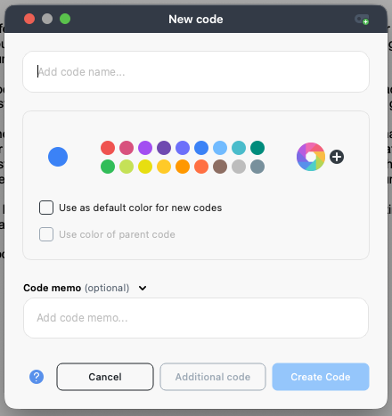
:::
:::::

## Editing codes

Once you've created codes, you edit, rearrange, and merge them as needed.

::::: columns
::: {.column width="40%"}
Most options for managing codes can be accessed by right-clicking on a code. You'll see a list of code options.
:::

::: {.columns width="60%"}
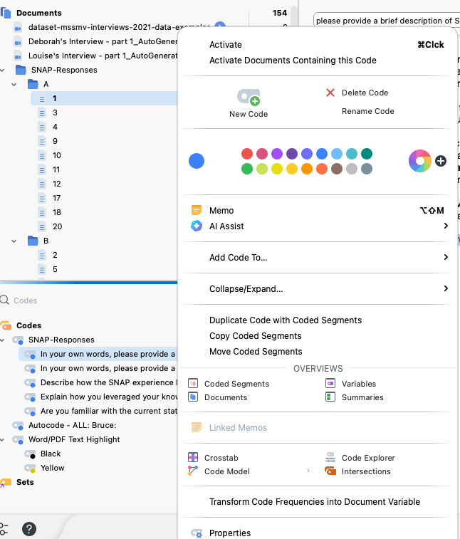
:::
:::::

## Organizing codes

Codes can be organized in a hierarchical system as you create them, or can be organized later. Your code system can be as complex as you need, with as many levels of hierarchy as makes sense for your project.

To add a new sub-code: hover over the code and look for the green plus icon.

To make a code a sub-code of another, drag the sub-code on top of the parent code.

## Applying codes to text data

::::: columns
::: {.column width="40%"}
When you select a segment of the data and right click, you'll see several options for coding:

1.  With a new code. If you select this option, you'll be prompted to create the new code.
2.  In Vivo: This option will label the data with the text of the segment, creating a new code if one does not already exist.
3.  With a recent code: There are three recently applied codes listed here that could be applied.

Alternately, if the code you want to apply already exists, you can select the segment and then click the code in the code system window.
:::

::: {.column width="60%"}
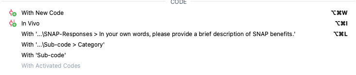
:::
:::::

## Changing document display to see codes

::::: columns
::: {.column width="40%"}
MAXQDA does not show the data you've coded in the code color by default. Instead you'll need to enable the display of coded segments:

1.  Look for the `...` in the upper left corner of the document window and click this icon to show the display options. This menu has several options for how the codes are displayed with your data.
2.  Check the `Coded segments in code color` box to show the data in the color assigned to the code.
:::

::: {.column width="60%"}
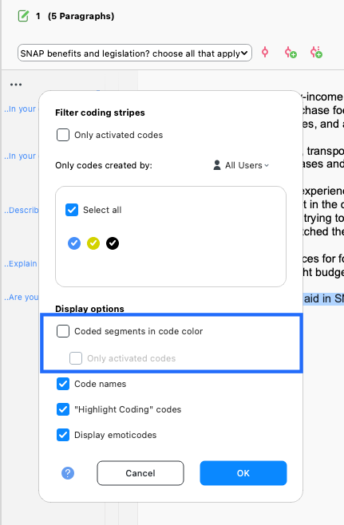
:::
:::::

##